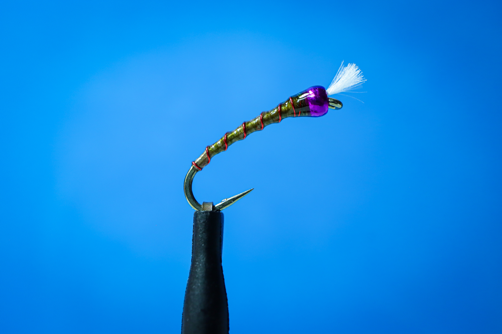
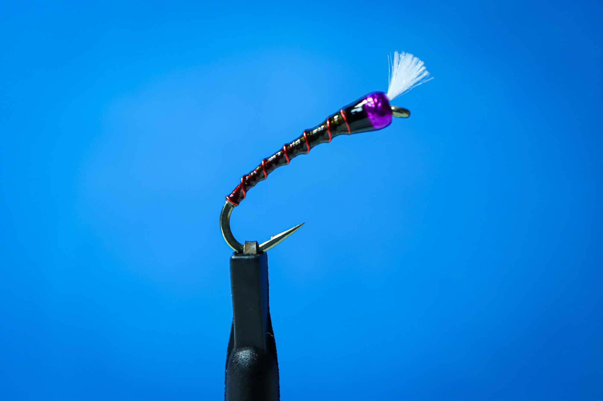

# 2026 Chironomid Pupa

## 📋 패턴 정보

**카테고리:** Chironomid  
**훅 사이즈:** #12  
**작성일:** 2025-01-23  
**난이도:** ⭐⭐⭐⭐⭐ (고급)  
**컨셉:** The Art of 'Deep' Color

## 🎨 Deepness Architecture

단순한 어두움을 넘어 물속에서 살아 움직이는 **'짙음(Deepness)'**을 구현하는 낚시대장만의 2026 타잉 레시피입니다. 굴절과 투과를 동시에 잡는 밸런스가 핵심입니다.

## 🎣 재료 (Materials)

### 기본 구성

| 항목 | 재료명 |
|------|--------|
| **Hook** | DAIICHI 1760 #12 (2X Long Curved, 2X Heavy) |
| **Under-Layer** | Thread (Tan/Cream, Red/Wine, Chartreuse 등) |
| **Body** | VEEVUS Body Quill BQ5 |
| **Ribbing** | Wire (색상 선택) |
| **Finish** | Thin UV Resin + Varnish |

### Hook 특징: DAIICHI 1760

| 특성 | 설명 |
|------|------|
| **Shank** | 2X Long Curved - 자연스러운 퓨파 곡선 |
| **Wire** | 2X Heavy - 추가 웨이트 없이도 안정적인 수직 하강 |
| **Gap** | Wide Gap - 확실한 훅셋 확률 |
| **Size** | #12 Standard - 저수지 관리형 낚시 범용 사이즈 |

## 🔨 타잉 프로세스 (4-Step Mastery)

### Step 01: Under-Layer
**밑실로 베이스 형성**
- 이 색상이 전체의 톤을 지배합니다
- 밝을수록 생동감, 어두울수록 중후함
- 물속에서 빛을 투과시킬 때 올라오는 '속광'을 결정

### Step 02: BQ5 Layer
**Body Quills를 감아 질감 표현**
- VEEVUS BQ5는 반투명
- 밑실이 비치도록 섬세하게 감기
- 밑실 색상에 따라 완전히 다른 발색

### Step 03: Wire Ribbing
**일정한 간격으로 와이어 감기**
- 분절 효과 부여
- 내구성 강화
- 마디가 선명한 퓨파 형태 완성

### Step 04: Final Finish
**투명 유리막 완성**
- 1차: Thin UV Resin으로 형태 고정
- 2차: 바니시로 유리알 같은 맑은 광택
- 물속에서 빛의 투과와 굴절 극대화

## 🎨 핵심 원리: Under-Layer Logic

### Backlighting Technique

밑실의 색상은 단순한 '바닥'이 아니라, 물속에서 빛을 투과시킬 때 올라오는 **'속광(Backlighting)'**을 결정합니다.

### VEEVUS BQ5의 비밀

**반투명 특성**
- 밑실이 밝을수록 → 생동감 넘치는 발색
- 밑실이 어두울수록 → 깊고 중후한 톤

**밑실 톤을 반 단계만 조절해도, 물속에서는 완전히 다른 생명체로 변합니다.**

## 🌈 Nuance Spectrum (Under-Layer Variations)

### 1️⃣ Tan/Cream Base

**발색:** Natural Clarity  
**특징:**
- 맑은 물에서 가장 자연스러운 수중 발색
- 높은 경계심 타파
- 만능 베이스 컬러
- 첫 수색 플라이로 최적

### 2️⃣ Red/Wine Base

**발색:** Aggressive Vividness  
**특징:**
- 피딩 타임에 강력한 존재감
- 흐린 물에서 공격성 자극
- 활성도 높은 시간대 특화
- 레드 계열 속광으로 어필

### 3️⃣ Chartreuse Base

**발색:** Electric Olive  
**특징:**
- 배어 나오는 형광기
- 활성도 좋은 개체 빠른 유혹
- 탁한 물색에서 효과적
- 공격적 어필 필요 시

## 💡 Jeff's Philosophy

> **"어두운(Dark) 것은 빛을 죽이지만,  
> 짙은(Deep) 것은 빛을 머금는다."**

이것이 2026 Chironomid Pupa의 철학입니다.

### Deepness vs Darkness

**Dark (어두움)**
- 빛을 차단
- 단순한 검은색
- 평면적인 실루엣

**Deep (짙음)**
- 빛을 머금음
- 투과와 굴절의 조화
- 입체적이고 살아있는 느낌

## 📊 추천 사용 조건

| 조건 | 최적값 |
|------|--------|
| **수심** | 1.5m - 4m |
| **물색** | Clear - Stained |
| **계절** | 연중 (특히 봄-가을) |
| **시간대** | 전 시간대 |
| **대상어** | 무지개송어, 갈색송어 |

## 🎯 전략적 포인트

### 밑실 선택 기준

**맑은 날, 맑은 물**
→ Tan/Cream Base (Natural Clarity)

**흐린 날, 약간 탁한 물**
→ Red/Wine Base (Aggressive Vividness)

**탁한 물, 활성 시간대**
→ Chartreuse Base (Electric Olive)

### 운용 테크닉

**인디케이터 채비**
- 목표 수심까지 천천히 침강
- 바닥 근처에서 미세한 움직임
- 데드 드리프트로 자연스러운 프레젠테이션

**슬로우 리트리브**
- 바닥에서 30cm 정도 천천히 들어 올리기
- 1-2초 Pause
- 반복하며 레이어 탐색

## 🔬 재료 상세: VEEVUS BQ5

### 특징
- 반투명 Body Quill
- 밑실 색상을 투과시키는 특성
- 얇고 균일한 두께
- 내구성 우수

### 사용 팁
- 밑실을 빈틈없이 감기
- BQ5를 느슨하지 않게, 그러나 너무 팽팽하지 않게
- 오버랩 최소화로 투명도 유지

## 🎨 컬러 조합 실험

| 밑실 | BQ5 | 와이어 | 결과 |
|------|-----|--------|------|
| Tan | Natural | Copper | 클래식 올리브 |
| Wine | Natural | Red | 다크 와인 |
| Chartreuse | Natural | Green | 일렉트릭 올리브 |
| Black | Natural | Silver | 다크 실루엣 |

## 💎 Premium Pro Standard

이 패턴은 **Premium Pro Standard**로 분류됩니다.

**왜 고급 패턴인가?**
- 밑실 색상 선택의 섬세함
- BQ5 감기의 정밀도
- UV + 바니시 2단계 마무리
- 빛의 투과와 굴절 이해 필요

## 🔗 Links

- [상세 페이지 보기](https://caddis-gr.github.io/fly-tying-archive/flies/chironomid/2026-chironomid-pupa/index.html)
- [메인 아카이브로 돌아가기](https://caddis-gr.github.io/fly-tying-archive/)

---

**Created by:** 낚시대장  
**Jeff's Fly Tying Lab** | "The Art of Deep Color" 🎨🎣
