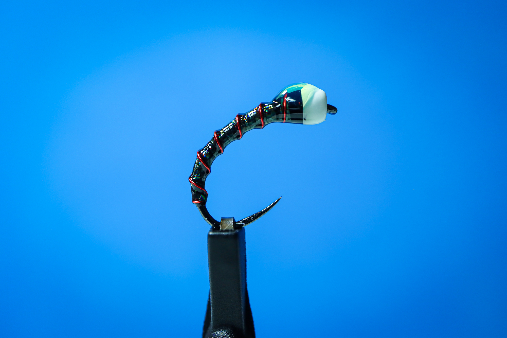

# Zucchini Chironomid Pupa

## 📋 패턴 정보

**카테고리:** Chironomid  
**훅 사이즈:** #14  
**작성일:** 2025-01-20  
**난이도:** ⭐⭐⭐ (중급)

## 🎣 재료 (Materials)

| 항목 | 재료명 |
|------|--------|
| **Hook** | FullingMill FM5065 #14 |
| **Bead** | Brass White Bead 2.4mm |
| **Body** | Dark Zucchini Base + Red Ribbing |
| **Point** | Distinct Bubble Dot |

## 🔨 타잉 프로세스 (Tying Process)

### 1. Base & Ribbing
바디 형태를 잡고 레드 리빙을 일정한 간격으로 감아 마디를 표현합니다.

### 2. 1st: Thin UV Coat
아주 얇은 UV 레진으로 전체적인 형태를 고정하고 바디를 보호합니다.

### 3. 2nd: Varnish Finish
바니시로 최종 코팅하여 유리알 같은 맑은 광택과 매끄러운 질감을 완성합니다.

## 🎯 핵심 포인트

### 👁️ 바디 컬러 & 질감 (Zucchini 톤)
- 그린–블랙 계열의 차분한 딥 톤
- 빛을 받으면 은은하게 반응하여 실루엣 강조
- 흐린 날·딥 워터에서도 실루엣 인지성 우수
- 과장 없는 리얼 계열로 첫 수색 플라이에 적합

### ⚡ 레드 리빙 (와이어)
- 핫스팟이 아닌 미세한 생체 신호 역할
- #14 사이즈 기준, 밀도와 대비가 절제됨
- 원거리 비노출 ▶️ 근접 시에만 작동하는 트리거

### ⭕ Bubble Dot (헤드 처리)
- 비드가 아닌 가스 버블의 잔상 표현
- 헤드에 시선 집중을 유도하는 최소한의 화이트
- 서스펜드 또는 슬로우 리프트 시 헤드가 먼저 인지되는 구조

## 💡 Jeff's Advice

> Thin UV로 기초를 다진 후 바니시 마무리는 낚시대장님만의 '유리알 광택' 비결입니다. 이 미세한 질감 차이가 저수지 예민한 송어들의 입질을 유도하는 결정적 차이를 만듭니다.

## 🔗 Links

- [상세 페이지 보기](https://caddis-gr.github.io/fly-tying-archive/flies/chironomid/zucchini-pupa/index.html)
- [메인 아카이브로 돌아가기](https://caddis-gr.github.io/fly-tying-archive/)

---

**Created by:** 낚시대장  
**Jeff's Fly Tying Lab** | Tight Lines! 🎣
