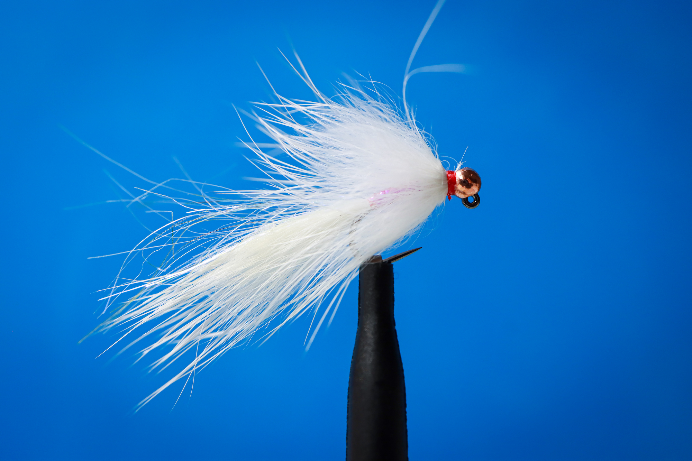
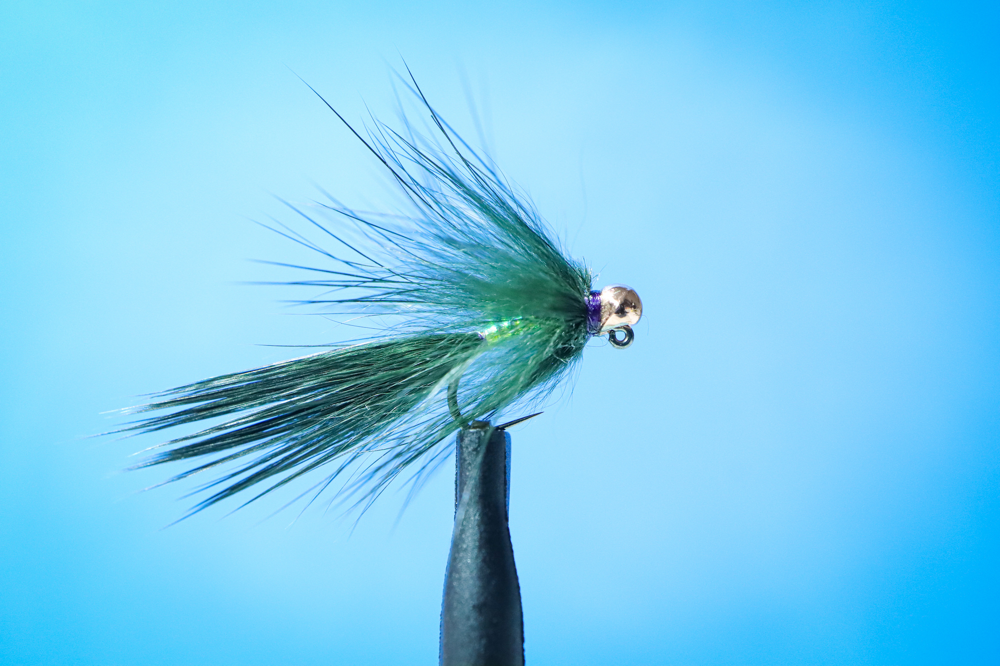
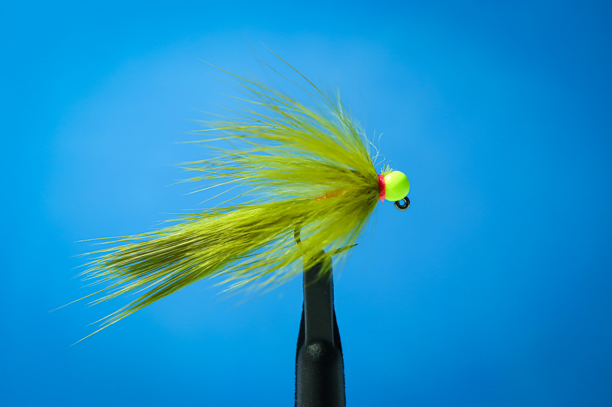

# White Zonker Collection



## 📋 패턴 정보

**카테고리:** Streamer  
**훅 사이즈:** #16  
**작성일:** 2025-01-20  
**난이도:** ⭐⭐⭐⭐ (중상급)  
**특징:** 6미터 수심 전용 치어 패턴 🎯

## 🎯 컬렉션 개요

6미터 깊은 곳, 빛이 닿지 않는 심해에서 송어의 시선을 강탈하는 **화이트 존커 컬렉션**. 3가지 컬러 로테이션 전략으로 완벽한 수심 공략이 가능합니다.

## 🎣 화이트 버전 레시피 (Main)

| 항목 | 재료명 |
|------|--------|
| **Hook** | FullingMill FM5140 #16 (지그 훅) |
| **Bead** | 텅스텐 골드 비드 2.3mm |
| **Tail/Collar** | 화이트 존커 파이버 (Rabbit) |
| **Body** | Mirage Opal Tinsel |
| **Thread** | Flat 70D Red (포인트) |
| **Finish** | SuperGlue Under-coat |

## 🐰 Rabbit Zonker Fiber 타잉 팁

### 가죽 제외, 털만 사용 시 추천 라인업

**Standard: CROSS CUT**
- 일반적인 볼륨감
- 균일한 털 길이
- 범용 스트리머에 적합

**High Volume: BIG GAME** ⭐
- **극강의 볼륨감**
- 털의 양이 방대함
- 수중 파동이 훨씬 강력
- 6미터 수심 전용 추천!

### 💡 PRO TIP
Big Game용은 털의 양이 방대하여 수중 파동이 훨씬 강력합니다. 6미터 수심 공략 시 필수!

## ⚡ 핵심 어필 포인트

### 🩸 선혈의 자극
레드 스레드 포인트로 아가미를 강조하여 송어의 공격 본능을 자극합니다.

### 👁️ 심해 가시성
6m 수심에서도 Opal Tinsel의 난반사가 송어의 시선을 사로잡습니다.

### 🛡️ 슬림 내구성
SuperGlue 코팅으로 저항을 최소화하며 내구성을 극대화합니다.

## 🎮 6미터 수심 전략

### ⏰ Timing
**피딩 타임 치어 사냥 활성기**
- 새벽/저녁 황금 시간대
- 치어 떼가 움직이는 시간
- 대형 송어의 사냥 시간

### 🎯 Action
**Vertical Drop 후 리액션 바이트**
1. 6미터까지 완전 침강
2. 바닥 터치 확인
3. 짧고 빠른 스트립 (30cm)
4. 1-2초 Pause
5. 도망가는 치어처럼 연출

### 💬 핵심 조언
> "도망가는 치어처럼 짧고 빠른 스트립!"

## 🎨 3단계 컬러 로테이션 전략

### 1️⃣ 탐색 (Purple & Black)


**용도:** 초반 수색, 저광량  
**특징:** 탁한 물색이나 저광량 상태에서 뚜렷한 실루엣으로 존재감 과시  
**추천 시간:** 새벽, 흐린 날

### 2️⃣ 안착 (Olive & Brown)


**용도:** 내추럴 어프로치  
**특징:** 맑은 물색과 예민한 송어의 경계심을 무너뜨리는 필살 내추럴 컬러  
**추천 시간:** 오전~오후, 맑은 날

### 3️⃣ 승부 (White & Chartreuse)


**용도:** 최종 마무리, 공격적 어필  
**특징:** 6미터 수심에서도 강력한 시각적 자극, 형광 효과로 최대 가시성  
**추천 시간:** 모든 시간대 (특히 딥 레인지)

## 🔄 로테이션 운용법

```
시작: Purple/Black (탐색)
  ↓ 반응 없음
중간: Olive/Brown (안착)
  ↓ 반응 미미
승부: White/Chartreuse (공격)
  ↓ 
SUCCESS! 🎣
```

## 📊 추천 사용 조건

| 조건 | 최적값 |
|------|--------|
| **수심** | 5-8m (딥 레인지) |
| **물색** | 맑음~약간 탁함 |
| **시간대** | 새벽/저녁 황금시간 |
| **계절** | 동절기~초봄 |
| **대상어** | 대형 무지개송어, 갈색송어 |
| **미끼 패턴** | 치어 사냥 활성기 |

## 🎯 전략적 포인트

### 왜 지그 훅인가?
- 바늘 끝이 위로 향해 **바닥 걸림 최소화**
- 6미터 수심에서 안전한 운용
- 훅업률 향상

### 왜 Opal Tinsel인가?
- 심해에서도 **빛의 난반사** 극대화
- 다양한 각도에서 플래시 효과
- 치어의 은빛 비늘 완벽 재현

### 왜 Red Thread 포인트인가?
- 아가미/혈점 형상화
- **선혈의 자극**으로 공격 본능 유발
- 미묘하지만 결정적인 트리거

## 💡 Jeff's Deep Strategy

### 6미터 수심 공략 핵심

**1. 완전 침강 확인**
- 서두르지 말고 충분히 기다리기
- 라인의 움직임으로 바닥 터치 확인
- 너무 빠른 리트리브는 금물

**2. 리액션 바이트 유도**
- 바닥에서 갑작스러운 움직임
- 짧고 빠른 스트립 (30cm)
- 1-2초 Pause로 유혹

**3. Big Game 존커의 위력**
- 풍부한 볼륨감으로 강력한 수중 파동
- 멀리서도 송어가 인지
- 측선 자극 극대화

## 🔗 Links

- [상세 페이지 보기](https://caddis-gr.github.io/fly-tying-archive/flies/streamer/white-zonker-collection/index.html)
- [메인 아카이브로 돌아가기](https://caddis-gr.github.io/fly-tying-archive/)

---

**Created by:** 낚시대장  
**Jeff's Fly Tying Lab** | "6미터 수심의 송어들을 만나는 가장 빠른 지도" 🎣✨
